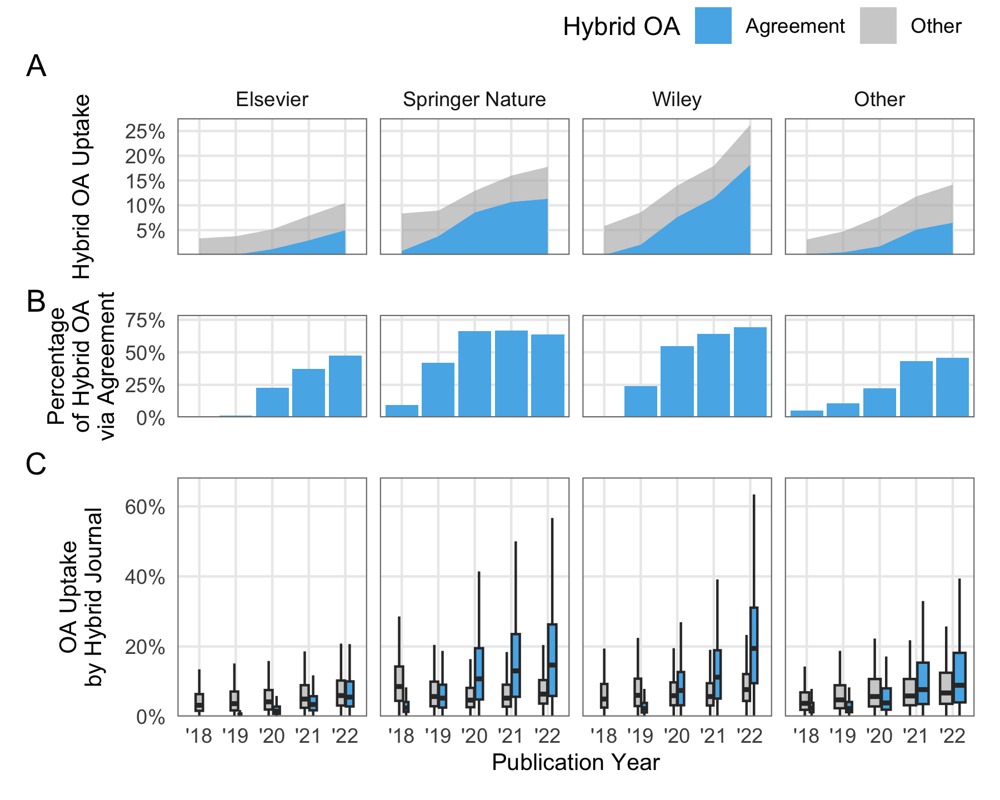
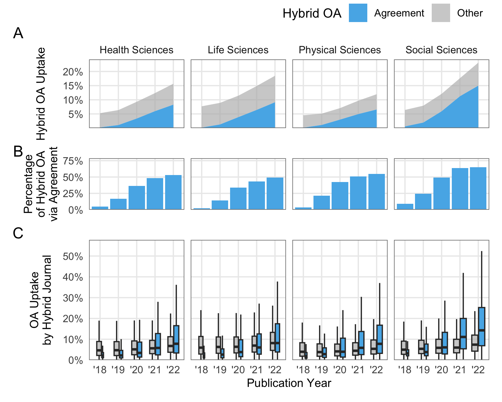

Overview
================
2023-12-07

What are the number and proportion of open access articles in hybrid
journals published under a transformative agreement?

Between 2018 and 2022, a total of 11,171 out of 12,681 hybrid journals
in transformative agreements published at least one open access article
under a Creative Commons license. During this period, these hybrid
journals provided open access to 747,238 out of 8,174,722 articles,
representing a five-year open access proportion of 9.1%. Authors who
could make use of transformative agreements at the time of publication
contributed 320,682 open access articles to the total.

Growth of open access in hybrid journals through transformative
agreements between 2018 and 2022 per publication year. The blue areas
represent open access through transformative agreements, as indicated by
the affiliation with institutions that had a corresponding
transformative agreement in place at the time of publication (according
to the first author affiliation data in OpenAlex matched with journal
and institutional data from cOAlition S Transformative Agreements Public
Data). (A) Proportion of open access articles in hybrid journals per
year (according to the total number of articles indexed in Crossref).
(B) Percentage of hybrid open access via agreements per year. Boxplots
show the proportion of open access articles by individual hybrid
journals (C) and individual open access uptake rates by individual
hybrid journals and open access funding (D) per publication year.
Horizontal lines denote lower quartile, median, and upper quartile, with
whiskers extending to ±1.5 of interquartile range. The individual
outliers are not shown. Note that data on transformative agreements
ending before June 2021 were not available at the time of this study.

Figure 2A shows a moderate growth in the proportion of open access
articles in hybrid journals, comparing the overall open access uptake
and the impact of transformative agreements on this trend. Over the
five-years period from 2018 to 2022, open access increased from 4.3% (n
= 66,154) to 15% (n = 250,804). At the same time, the total article
volume of the investigated journals grew from 1,533,372 in 2018 to
1,680,807 in 2022.

Figure 2B highlights that the majority of open access articles in hybrid
journals were made available through transformative agreements in 2021
and 2022, contributing 55% of the total open access article volume in
2022. However, there was also a notable growth in open access provision
through individual publication fees, which increased from 4.1% (n =
63,334) in 2018 to 6.7% (n = 111,858). This suggests that publishers
were able to gain equally from individual and institutional open access
publishing options.

Figure 2C depicts the substantial variations among the hybrid journals
included in transformative agreements in terms of open access uptake.
Although the median generally follows the trend shown in Figure 2A, the
farther stretch of upper quartiles and whiskers over the years
illustrates that an increasing number of journals published an
above-average proportion of open access articles. In 2022, 25% of hybrid
journals (n = 2,568) had an open access uptake of 29%, and 6.6% of
journals (n = 742) provided the majority of their articles under a
Creative Commons license in the same year. These journals were, on
average, smaller (M = 77, SD = 189) than those with an open access share
below 50% (M = 165, SD = 347). Notable exception of large journals with
an above-average open access proportion were Physical Review D, a
high-energy physics journal covered by the SCOAP3 consortium that
provided open access to 2,341 out of 4,074 articles in 2022, Astronomy
and Physics (1,396 out of 2,230 articles in 2022 were open access),
which shifted to a subscribe to open business model for all accepted
articles as of April 2022, the Journal of Fluid Mechanics (577 of 1,077
articles in 2022 were open access) and Bioinformatics (405 out of 777
articles in 2022 were open access), which flipped to full open access as
of January 2023.

When comparing the impact of open access trough transformative
agreements across journals, it shows that for many journals these
agreements substantially contributed to the growth of open access over
the years (Figure 2D). Examples of such journals include those with a
scope on specific countries or regions, where also transformative
agreements were implemented. For instance, in 2022, the Germany-based
journals Zeitschrift für Erziehungswissenschaft and Zeitschrift für
Politikwissenschaft, as well as the Scandinavian Political Studies
adressing the Nordic countries, achieved an overall open access uptake
of more than 90% just through transformative agreements. Despite the
rise in transformative agreements, it is worth noting that other means
of publishing open access in hybrid journals remained common. In total,
9,223 journals published open access articles from authors affiliated
with institutions without transformative agreements in place, while
8,715 journals published at least one open access article through a
transformative agreement in the same year.

<table class=" lightable-classic" style="font-family: &quot;Arial Narrow&quot;, &quot;Source Sans Pro&quot;, sans-serif; margin-left: auto; margin-right: auto;">
<caption>
Hybrid open access through transformative agreements market shares
2018-2022
</caption>
<thead>
<tr>
<th style="empty-cells: hide;" colspan="1">
</th>
<th style="padding-bottom:0; padding-left:3px;padding-right:3px;text-align: center; " colspan="3">

Hybrid journals

</th>
<th style="padding-bottom:0; padding-left:3px;padding-right:3px;text-align: center; " colspan="3">

Articles

</th>
<th style="padding-bottom:0; padding-left:3px;padding-right:3px;text-align: center; " colspan="3">

OA articles

</th>
<th style="padding-bottom:0; padding-left:3px;padding-right:3px;text-align: center; " colspan="3">

TA OA articles

</th>
</tr>
<tr>
<th style="text-align:left;">
Publisher
</th>
<th style="text-align:right;">
Total
</th>
<th style="text-align:left;">
%
</th>
<th style="text-align:left;">
C%
</th>
<th style="text-align:right;">
Total
</th>
<th style="text-align:left;">
%
</th>
<th style="text-align:left;">
C%
</th>
<th style="text-align:right;">
Total
</th>
<th style="text-align:left;">
%
</th>
<th style="text-align:left;">
C%
</th>
<th style="text-align:right;">
Total
</th>
<th style="text-align:left;">
%
</th>
<th style="text-align:left;">
C%
</th>
</tr>
</thead>
<tbody>
<tr>
<td style="text-align:left;">
Elsevier
</td>
<td style="text-align:right;">
1,946
</td>
<td style="text-align:left;">
17.2
</td>
<td style="text-align:left;">
17.2
</td>
<td style="text-align:right;">
2,788,990
</td>
<td style="text-align:left;">
33.9
</td>
<td style="text-align:left;">
33.9
</td>
<td style="text-align:right;">
174,479
</td>
<td style="text-align:left;">
23.1
</td>
<td style="text-align:left;">
23.1
</td>
<td style="text-align:right;">
53,617
</td>
<td style="text-align:left;">
16.7
</td>
<td style="text-align:left;">
16.7
</td>
</tr>
<tr>
<td style="text-align:left;">
Springer Nature
</td>
<td style="text-align:right;">
2,252
</td>
<td style="text-align:left;">
19.9
</td>
<td style="text-align:left;">
37
</td>
<td style="text-align:right;">
1,325,575
</td>
<td style="text-align:left;">
16.1
</td>
<td style="text-align:left;">
50
</td>
<td style="text-align:right;">
174,074
</td>
<td style="text-align:left;">
23
</td>
<td style="text-align:left;">
46.1
</td>
<td style="text-align:right;">
97,872
</td>
<td style="text-align:left;">
30.5
</td>
<td style="text-align:left;">
47.1
</td>
</tr>
<tr>
<td style="text-align:left;">
Wiley
</td>
<td style="text-align:right;">
1,416
</td>
<td style="text-align:left;">
12.5
</td>
<td style="text-align:left;">
49.5
</td>
<td style="text-align:right;">
1,059,147
</td>
<td style="text-align:left;">
12.9
</td>
<td style="text-align:left;">
62.9
</td>
<td style="text-align:right;">
154,907
</td>
<td style="text-align:left;">
20.5
</td>
<td style="text-align:left;">
66.5
</td>
<td style="text-align:right;">
84,538
</td>
<td style="text-align:left;">
26.3
</td>
<td style="text-align:left;">
73.4
</td>
</tr>
<tr>
<td style="text-align:left;">
Other
</td>
<td style="text-align:right;">
5,727
</td>
<td style="text-align:left;">
50.5
</td>
<td style="text-align:left;">
100
</td>
<td style="text-align:right;">
3,056,581
</td>
<td style="text-align:left;">
37.1
</td>
<td style="text-align:left;">
100
</td>
<td style="text-align:right;">
253,105
</td>
<td style="text-align:left;">
33.5
</td>
<td style="text-align:left;">
100
</td>
<td style="text-align:right;">
85,333
</td>
<td style="text-align:left;">
26.6
</td>
<td style="text-align:left;">
100
</td>
</tr>
</tbody>
</table>

Analysing hybrid open access across publishers between 2018 and 2022
reveals a large market concentration. Although 47 publishers offered
transformative agreements, the big three commercial publishers Elsevier,
Springer Nature, and Wiley, accounted for 50% of total article volume
published (see Table ). Together, they published 503,460 open access
articles, representing 67% of the open access articles in hybrid
journals. Elsevier, Springer Nature, and Wiley made 236,027 articles
open access in hybrid journals through transformative agreements,
resulting in an even larger market share of 73%. However, there are
differences among the three large publishers. Although Elsevier
published the largest volume of articles (n = 2,788,990, 34%), it
published a relatively low number of open access articles, including
those that can be associated with transformative agreements. In
contrast, Springer Nature and Wiley provided open access to a larger
proportion of their articles (13% of Springer Nature articles and 15% of
Wiley articles were open acccess), leading to higher open access market
shares (23% Springer Nature resp. 23% Wiley). This difference between
Elsevier on the one hand and Springer Nature and Wiley on the other can
be attributed to transformative agreements, as the latter made the
majority of their open access articles available through such deals
(Springer Nature 56% resp. Wiley 55%).

Figure 2 takes a closer look into the growth of hybrid open access
across publishers by year with a focus on open articles enabled by
transformative agreements. Although all publishers show a general
long-term trend towards transformative agreements, Figure 2A and 2B
indicate that, in particular, Wiley’s has experienced a substantial
increase in its open access share from 5.8% (n = 11,672) in 2018 to 26%
(n = 54,753) in 2022, rperesenting an 4.5-fold increase. In contrast,
Elsevier’s hybrid journals deonstrated a more modest increase, from 3.3%
(n = 17,017) in 2018 to 10% (n = 61,620) in 2022, which is a relatively
low open access share compared to the general trend. In 2018, Springer
Nature had the largest open access proportion among the three publishers
of 8.4% (n = 19,577), but experienced a relatively slower growth,
resulting in 18% (n = 52,116) of articles being open access in Springer
Nature hybrid journals in 2022.

The varying degrees of uptake of open access across the three major
publishers can be attributed to distinct approaches to transformative
agreements. Springer Nature, for example, began in 2015 offering
selected consortia, such as the Max Planck Society, the Swedish Bibsam
consortium, and the Finnish FinELib consortium, open access agreements
for its hybrid journal portfolio under the name Springer Compact[^1].
However, these agreements were not included in the data as they
concluded prior to the start of the transformative agreement data
collection in June 2021. Nonetheless, the results suggest the importance
of central agreements for Springer Nature’s hybrid open access business
over the past five years (Figure 2B). In 2022, 64% (n = 33,211) of open
access articles in f Springer Nature hybrid journals were enabled
through transformative agreements. In the same year, 69% (n = 37,923) of
Wiley’s open access articles could be linked to transformative
agreements in 2022. In contrast, Elsevier published fewer than half of
its open access articles through transformative agreements (n = 29,347;
48%).

The increasing trend towards transformative agreements can be also
observed at the journal-level (Figure 2). While no substantial
differences between open access enabled through transformative
agreements and other revenue source could observed across Elsevier
journals, the distribution of open access across Springer Nature and
Wiley hybrid journals indicates that the growth is not limited to a few
journals, but extends across the portfolio. In particular, Wiley’s upper
quantile, which represents the top 25% of journals in terms of the
proportion of open access articles from transformative agreements,
increased markedly from 13% in 2020 to 31% in 2022. At the same time,
the median proportion grew from 7.4% to 19%. It is interesting to note
that a small but increasing number of journals from these two publishers
are providing open access to the majority of articles through
transformative agreements. Wiley recorded 66 and Springer Nature 98
hybrid journals with an open access share above 50% that could be solely
attributed to transformative agreements. Upon inspection, these journals
were mainly society or local language journals with a small yearly
article volume.

Next, I focus on the subject distribution.

Here’s a table. I applied fractional counting because of large overlaps.

<table class=" lightable-classic" style="font-family: &quot;Arial Narrow&quot;, &quot;Source Sans Pro&quot;, sans-serif; margin-left: auto; margin-right: auto;">
<caption>
Hybrid open access through transformative agreements by journal subject
2018-2022
</caption>
<thead>
<tr>
<th style="empty-cells: hide;" colspan="1">
</th>
<th style="padding-bottom:0; padding-left:3px;padding-right:3px;text-align: center; " colspan="3">

Hybrid journals

</th>
<th style="padding-bottom:0; padding-left:3px;padding-right:3px;text-align: center; " colspan="3">

Articles

</th>
<th style="padding-bottom:0; padding-left:3px;padding-right:3px;text-align: center; " colspan="3">

OA articles

</th>
<th style="padding-bottom:0; padding-left:3px;padding-right:3px;text-align: center; " colspan="3">

TA OA articles

</th>
</tr>
<tr>
<th style="text-align:left;">
Journal subject
</th>
<th style="text-align:right;">
Total
</th>
<th style="text-align:left;">
%
</th>
<th style="text-align:left;">
C%
</th>
<th style="text-align:right;">
Total
</th>
<th style="text-align:left;">
%
</th>
<th style="text-align:left;">
C%
</th>
<th style="text-align:right;">
Total
</th>
<th style="text-align:left;">
%
</th>
<th style="text-align:left;">
C%
</th>
<th style="text-align:right;">
Total
</th>
<th style="text-align:left;">
%
</th>
<th style="text-align:left;">
C%
</th>
</tr>
</thead>
<tbody>
<tr>
<td style="text-align:left;">
Health Sciences
</td>
<td style="text-align:right;">
2,385
</td>
<td style="text-align:left;">
22.5
</td>
<td style="text-align:left;">
22.5
</td>
<td style="text-align:right;">
2,687,326
</td>
<td style="text-align:left;">
27.6
</td>
<td style="text-align:left;">
27.6
</td>
<td style="text-align:right;">
282,076
</td>
<td style="text-align:left;">
27.1
</td>
<td style="text-align:left;">
27.1
</td>
<td style="text-align:right;">
107,871
</td>
<td style="text-align:left;">
24.9
</td>
<td style="text-align:left;">
24.9
</td>
</tr>
<tr>
<td style="text-align:left;">
Life Sciences
</td>
<td style="text-align:right;">
1,424
</td>
<td style="text-align:left;">
13.4
</td>
<td style="text-align:left;">
35.9
</td>
<td style="text-align:right;">
1,492,070
</td>
<td style="text-align:left;">
15.4
</td>
<td style="text-align:left;">
43
</td>
<td style="text-align:right;">
195,154
</td>
<td style="text-align:left;">
18.7
</td>
<td style="text-align:left;">
45.8
</td>
<td style="text-align:right;">
66,183
</td>
<td style="text-align:left;">
15.3
</td>
<td style="text-align:left;">
40.2
</td>
</tr>
<tr>
<td style="text-align:left;">
Physical Sciences
</td>
<td style="text-align:right;">
2,748
</td>
<td style="text-align:left;">
25.9
</td>
<td style="text-align:left;">
61.8
</td>
<td style="text-align:right;">
4,277,476
</td>
<td style="text-align:left;">
44
</td>
<td style="text-align:left;">
87
</td>
<td style="text-align:right;">
366,536
</td>
<td style="text-align:left;">
35.2
</td>
<td style="text-align:left;">
81
</td>
<td style="text-align:right;">
154,952
</td>
<td style="text-align:left;">
35.8
</td>
<td style="text-align:left;">
76
</td>
</tr>
<tr>
<td style="text-align:left;">
Social Sciences
</td>
<td style="text-align:right;">
4,050
</td>
<td style="text-align:left;">
38.2
</td>
<td style="text-align:left;">
100
</td>
<td style="text-align:right;">
1,262,342
</td>
<td style="text-align:left;">
13
</td>
<td style="text-align:left;">
100
</td>
<td style="text-align:right;">
198,422
</td>
<td style="text-align:left;">
19
</td>
<td style="text-align:left;">
100
</td>
<td style="text-align:right;">
103,702
</td>
<td style="text-align:left;">
24
</td>
<td style="text-align:left;">
100
</td>
</tr>
</tbody>
</table>

[^1]: <https://web.archive.org/web/20180414062853id_/http://www.liber2015.org.uk/wp-content/uploads/2015/03/Springer-Compact.pdf>
