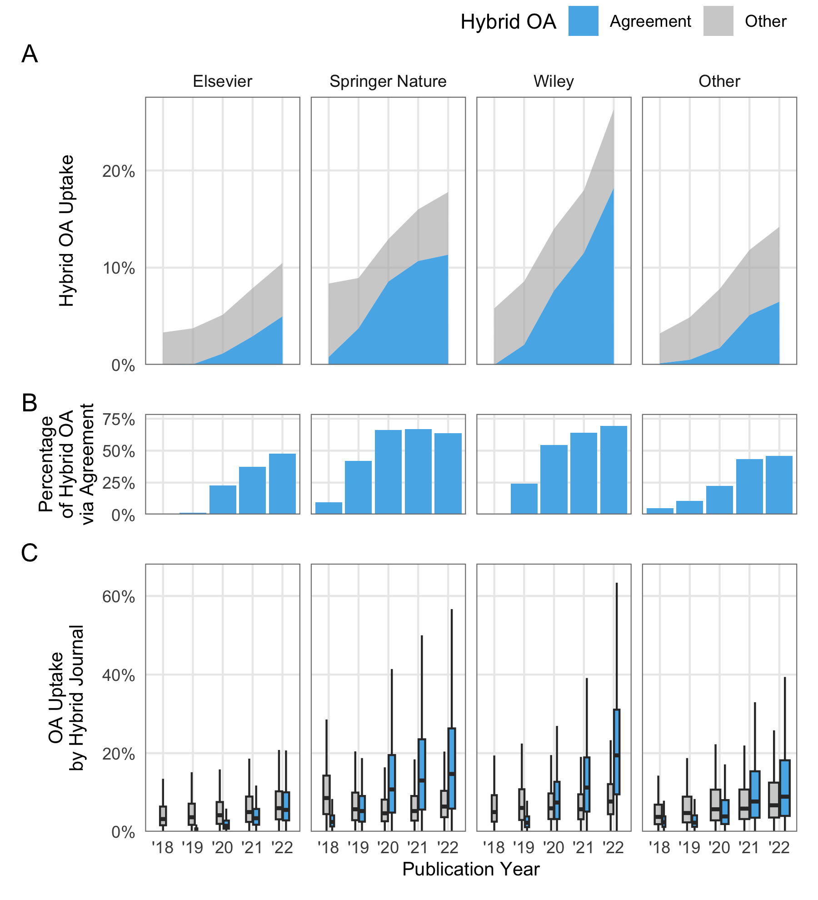

Overview
================
2023-12-02

What are the number and proportion of open access articles in hybrid
journals published under a transformative agreement?

Between 2018 and 2022, a total of 11,171 out of 12,681 hybrid journals
in transformative agreements published at least one open access article
under a Creative Commons license. During this period, these hybrid
journals provided open access to 747,238 out of 8,174,722 articles,
representing a five-year hybrid open access uptake of 9.1%. First
authors affiliated with institutions that had a transformative agreement
in place at the time of publication, which indicates that they could
make use of such agreements, contributed 320,682 open access articles to
the total.

Growth of open access in hybrid journals through transformative
agreements between 2018 and 2022 per publication year. The blue areas
represent open access through transformative agreements, as indicated by
the affiliation with institutions that had a corresponding
transformative agreement in place at the time of publication (according
to the first author affiliation data in OpenAlex matched with journal
and institutional data from cOAlition S Transformative Agreements Public
Data). (A) Proportion of open access articles in hybrid journals per
year (according to the total number of articles indexed in Crossref).
(B) Percentage of hybrid open access via agreements per year. Boxplots
show the proportion of open access articles by individual hybrid
journals (C) and individual open access uptake rates by individual
hybrid journals and open access funding (D) per publication year.
Horizontal lines denote lower quartile, median, and upper quartile, with
whiskers extending to ±1.5 of interquartile range. The individual
outliers are not shown. Note that data on transformative agreements
ending before June 2021 were not available at the time of this study.

Figure 2A shows a moderate growth in the proportion of open access
articles in hybrid journals, comparing the overall open access uptake
and the impact of transformative agreements on this trend. Over the
five-years period from 2018 to 2022, open access increased from 4.3% (n
= 66,154) to 15% (n = 250,804). At the same time, the total article
volume of the investigated journals grew from 1,533,372 in 2018 to
1,680,807 in 2022.

Figure 2B highlights that the majority of open access articles in hybrid
journals were made available through transformative agreements in 2021
and 2022, contributing 55% of the total open access article volume in
2022. However, there was also a notable growth in open access provision
through individual publication fees, which increased from 4.1% (n =
63,334) in 2018 to 6.7% (n = 111,858). This suggests that publishers
were able to gain equally from individual and institutional open access
publishing options.

Figure 2C depicts the substantial variations among the hybrid journals
included in transformative agreements in terms of open access uptake.
Although the median generally follows the trend shown in Figure 2A, the
farther stretch of upper quartiles and whiskers over the years
illustrates that an increasing number of journals published an
above-average proportion of open access articles. In 2022, 25% of hybrid
journals (n = 2,568) had an open access uptake of 29%, and 6.6% of
journals (n = 742) provided the majority of their articles under a
Creative Commons license in the same year. These journals were, on
average, smaller (M = 77, SD = 189) than those with an open access share
below 50% (M = 165, SD = 347). Notable exception of large journals with
an above-average open access proportion were Physical Review D, a
high-energy physics journal covered by the SCOAP3 consortium that
provided open access to 2,341 out of 4,074 articles in 2022, Astronomy
and Physics (1,396 out of 2,230 articles in 2022 were open access),
which shifted to a subscribe to open business model for all accepted
articles as of April 2022, the Journal of Fluid Mechanics (577 of 1,077
articles in 2022 were open access) and Bioinformatics (405 out of 777
articles in 2022 were open access), which flipped to full open access as
of January 2023.

When comparing the impact of open access trough transformative
agreements across journals, it shows that for many journals these
agreements have been a significant contributor to the growth of open
access over the years (Figure 2D). Examples of such journals include
those with a scope on specific countries or regions, where also
transformative agreements were implemented. For instance, in 2022, the
Germany-based journals Zeitschrift für Erziehungswissenschaft and
Zeitschrift für Politikwissenschaft, as well as the Scandinavian
Political Studies adressing the Nordic countries, achieved an overall
open access uptake of more than 90% just through transformative
agreements. Despite the rise in transformative agreements, it is worth
noting that other means of publishing open access in hybrid journals
remained common. In total, 9,223 journals published open access articles
from authors affiliated with institutions without transformative
agreements in place, while 8,715 journals published at least one open
access article through a transformative agreement in the same year.

Analysing hybrid open access across publishers between 2018 and 2022
reveals a large concentration on a few publishers in terms of
publication volume. While transformative agreements could be attributed
to 0 distinct publishers, the three publishers Elsevier, Springer Nature
and Wiley accounted for xxx percent of articles published. Together,
they published xxx articles, representing a share of xx percent. xxx
were published through transformative agreements. The remainder consists
of

<table class=" lightable-classic" style="font-family: &quot;Arial Narrow&quot;, &quot;Source Sans Pro&quot;, sans-serif; margin-left: auto; margin-right: auto;">
<thead>
<tr>
<th style="empty-cells: hide;" colspan="1">
</th>
<th style="padding-bottom:0; padding-left:3px;padding-right:3px;text-align: center; " colspan="3">

Hybrid journals

</th>
<th style="padding-bottom:0; padding-left:3px;padding-right:3px;text-align: center; " colspan="3">

Articles

</th>
<th style="padding-bottom:0; padding-left:3px;padding-right:3px;text-align: center; " colspan="3">

OA articles

</th>
<th style="padding-bottom:0; padding-left:3px;padding-right:3px;text-align: center; " colspan="3">

TA OA articles

</th>
</tr>
<tr>
<th style="text-align:left;">
Publisher
</th>
<th style="text-align:right;">
Total
</th>
<th style="text-align:left;">
%
</th>
<th style="text-align:left;">
C%
</th>
<th style="text-align:right;">
Total
</th>
<th style="text-align:left;">
%
</th>
<th style="text-align:left;">
C%
</th>
<th style="text-align:right;">
Total
</th>
<th style="text-align:left;">
%
</th>
<th style="text-align:left;">
C%
</th>
<th style="text-align:right;">
Total
</th>
<th style="text-align:left;">
%
</th>
<th style="text-align:left;">
C%
</th>
</tr>
</thead>
<tbody>
<tr>
<td style="text-align:left;">
Elsevier
</td>
<td style="text-align:right;">
1,946
</td>
<td style="text-align:left;">
17.2
</td>
<td style="text-align:left;">
17.2
</td>
<td style="text-align:right;">
2,788,990
</td>
<td style="text-align:left;">
33.9
</td>
<td style="text-align:left;">
33.9
</td>
<td style="text-align:right;">
174,479
</td>
<td style="text-align:left;">
23.1
</td>
<td style="text-align:left;">
23.1
</td>
<td style="text-align:right;">
53,617
</td>
<td style="text-align:left;">
16.7
</td>
<td style="text-align:left;">
16.7
</td>
</tr>
<tr>
<td style="text-align:left;">
Springer Nature
</td>
<td style="text-align:right;">
2,252
</td>
<td style="text-align:left;">
19.9
</td>
<td style="text-align:left;">
37
</td>
<td style="text-align:right;">
1,325,575
</td>
<td style="text-align:left;">
16.1
</td>
<td style="text-align:left;">
50
</td>
<td style="text-align:right;">
174,074
</td>
<td style="text-align:left;">
23
</td>
<td style="text-align:left;">
46.1
</td>
<td style="text-align:right;">
97,872
</td>
<td style="text-align:left;">
30.5
</td>
<td style="text-align:left;">
47.1
</td>
</tr>
<tr>
<td style="text-align:left;">
Wiley
</td>
<td style="text-align:right;">
1,416
</td>
<td style="text-align:left;">
12.5
</td>
<td style="text-align:left;">
49.5
</td>
<td style="text-align:right;">
1,059,147
</td>
<td style="text-align:left;">
12.9
</td>
<td style="text-align:left;">
62.9
</td>
<td style="text-align:right;">
154,907
</td>
<td style="text-align:left;">
20.5
</td>
<td style="text-align:left;">
66.5
</td>
<td style="text-align:right;">
84,538
</td>
<td style="text-align:left;">
26.3
</td>
<td style="text-align:left;">
73.4
</td>
</tr>
<tr>
<td style="text-align:left;">
Other
</td>
<td style="text-align:right;">
5,727
</td>
<td style="text-align:left;">
50.5
</td>
<td style="text-align:left;">
100
</td>
<td style="text-align:right;">
3,056,581
</td>
<td style="text-align:left;">
37.1
</td>
<td style="text-align:left;">
100
</td>
<td style="text-align:right;">
253,105
</td>
<td style="text-align:left;">
33.5
</td>
<td style="text-align:left;">
100
</td>
<td style="text-align:right;">
85,333
</td>
<td style="text-align:left;">
26.6
</td>
<td style="text-align:left;">
100
</td>
</tr>
</tbody>
</table>

Figure 2 presents the growth of hybrid open access across publishers by
year, highlighting the proportion of open articles published under
transformative agreements. As can be seen from Figure 2A and 2C

