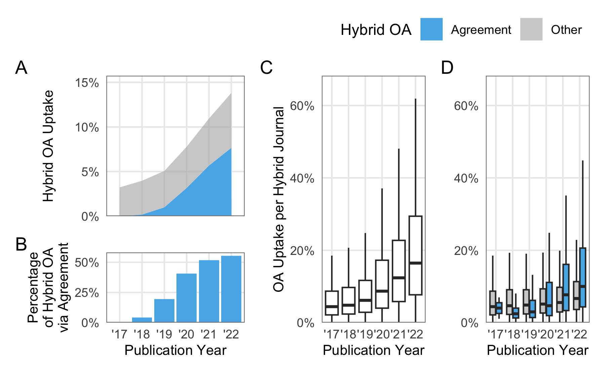
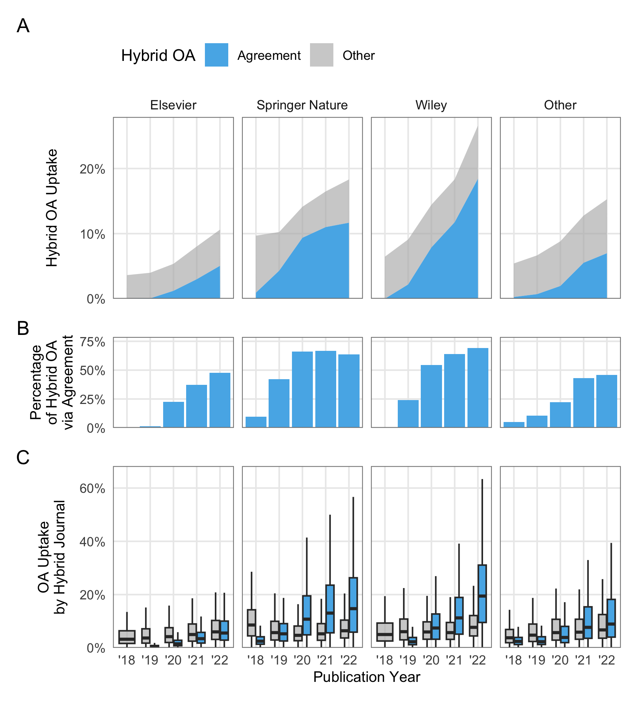

Overview
================
2023-11-21

What are the number and proportion of open access articles in hybrid
journals published under a transformative agreement?

Between 2017 and 2022, a total of 11,171 out of 12,681 hybrid journals
in transformative agreements provided at least one open access article
under a Creative Commons license. During this period, 747,238 out of
7,350,721 articles in these journals became open access, representing a
five-year hybrid open access uptake rate of 10%. First authors
affiliated with institutions that had a transformative agreement in
place at the time of publication, which indicates that they could make
use of such agreements, contributed 320,682 open access articles to the
total.

Caption:

